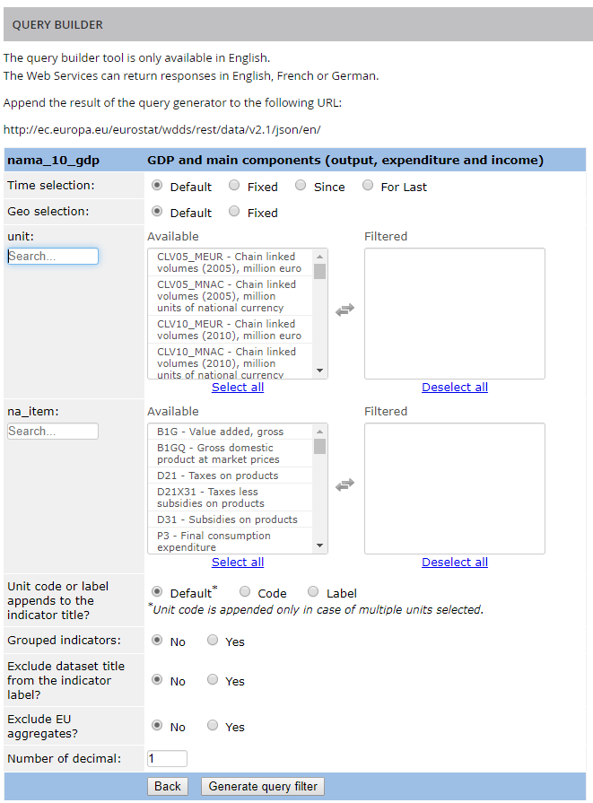
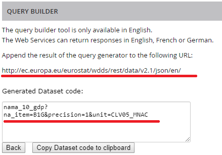

Eurostat-API-custom-connector
=============================

Power BI custom connector for _Eurostat_ API.
---

The connector delivered by this project allows for access to [Eurostat’s REST API](https://ec.europa.eu/eurostat/web/json-and-unicode-web-services/getting-started/rest-request), which delivers data in JSON-stat format. Although it is possible to load data in JSON-stat format to Power BI, it is not straightforward ([you can try to do it using this guide](https://eriksvensen.wordpress.com/2019/01/09/guide-how-to-import-data-from-eurostat-directly-into-powerbi) )

### Installation

To use a Custom Connector, put Eurostat API.mez file in the [Documents]\Power BI Desktop\Custom Connectors folder, and adjust the security settings as described [on this website](https://docs.microsoft.com/en-us/power-bi/desktop-connector-extensibility).

### How to use

Power BI uses star schema model to connect datasets. Data returned from Eurostat’s API have many dimensions ( Year, Geo, Sex, …). The connector splits every dimension into separate tables and create common id which connects all tables. There are three steps necessary to load data from the Eurostat’s API to Power Bi:
1)	Find a dataset
2)	Create an URL
3)	Load data

#### Step 1. Finding a dataset

Datasets can be found in [Eurostat’s database](https://ec.europa.eu/eurostat/data/database).

<table>
<header>
<td align="centre">Eurostat's database</td>
</header>
<tr>
<td><kbd></kbd></td>
</tr>
</table>

Each dataset has its unique code (like nama_10_gdp). This code is necessary in the next step.

#### Step 2. Creating an URL

In order to get data from Eurostat, connector needs properly formated URL to Eurostat's API. The best way to create this URL is to use [Query Builder](https://ec.europa.eu/eurostat/web/json-and-unicode-web-services/getting-started/query-builder).

<table>
<header>
<td align="centre">Query builder</td>
</header>
<tr>
<td><kbd></kbd></td>
</tr>
</table>

Building an URL is quite an easy task. The process in explaind well on the Eurostat's website.

<table>
<header>
<td align="centre">Query generator</td>
</header>
<tr>
<td><kbd></kbd></td>
</tr>
</table>

The only caveat is that there is a limit to the number of categories - 50. If this limit is exceeded, no data is returned. The Connector will show this error:

<table>
<header>
<td align="centre">Error</td>
</header>
<tr>
<td><kbd></kbd></td>
</tr>
</table>

The output generated by the Query Builder will be like this:

<table>
<header>
<td align="centre">Query generator - output</td>
</header>
<tr>
<td><kbd></kbd></td>
</tr>
</table>

#### Step 3. Loading data

The URL generated in the Quey Builder (step 2) is the only paramater which has to be passed to the connector. The connector has only one field - it is enough to paste the URL into this field.

<table>
<header>
<td align="centre">Connector</td>
</header>
<tr>
<td><kbd></kbd></td>
</tr>
</table>

If the URL entered into the connector is properly formated, Power BI will show the Navigator window with all dimensions/tables. It might be used to preview data before transferring it from Eurostat.

<table>
<header>
<td align="centre">Navigator</td>
</header>
<tr>
<td><kbd></kbd></td>
</tr>
</table>

The Connector creates tables for all dimensions. Two additional tables are created : _Relations_ and _Information._ The table _Relations_ store relations between all dimensions(tables). The table _Information_ shows information about query.

<table>
<header>
<td align="centre">Table with information on the query</td>
</header>
<tr>
<td><kbd></kbd></td>
</tr>
</table>

One relation – between tables   _Relations_ and _values_ - must be created manually:

<table>
<header>
<td align="centre">Cretae reltionship</td>
</header>
<tr>
<td><kbd></kbd></td>
</tr>
</table>

The final model should look like this:

<table>
<header>
<td align="centre">Model</td>
</header>
<tr>
<td><kbd></kbd></td>
</tr>
</table>

### About

<table align="center">
    <tr> <td align="left"><i>status</i></td> <td align="left">since 2020</td></tr> 
    <tr> <td align="left"><i>contributors</i></td> 
    <td align="left" valign="middle">

</td> </tr> 
    <tr> <td align="left"><i>license</i></td> <td align="left"><a href="https://joinup.ec.europa.eu/sites/default/files/eupl1.1.-licence-en_0.pdfEUPL">EUPL</a> </td> </tr> 
</table>
